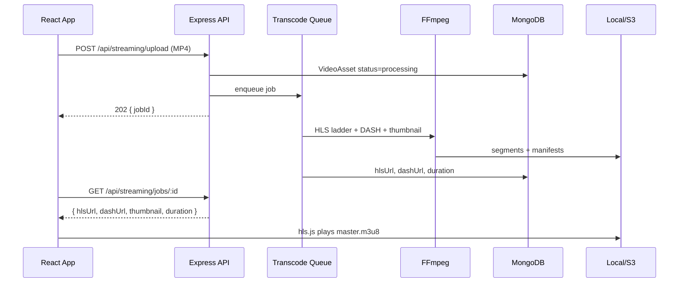

# Adaptive Video Streaming Architecture (Instagram / Reels Style)

This document describes the end-to-end MP4 upload → FFmpeg transcode → HLS/DASH delivery → Reels player flow implemented in this project.

## Stack

| Layer | Technology |
|-------|------------|
| Frontend | React 18 + Vite, **hls.js**, Intersection Observer |
| API | Node.js + Express 5 |
| Transcoding | **FFmpeg** (fluent-ffmpeg + CLI for DASH) |
| Database | MongoDB (`Product.videoStream`, `VideoAsset`) |
| Storage | Local disk (`/uploads/streaming`) or **AWS S3** (optional) |
| Player | `ReelStreamPlayer` — HLS primary, MP4 fallback |

## High-Level Flow



Product posts (`POST /api/products`) follow the same transcode queue after `compressVideo` produces the MP4.

## Folder Structure

```
server/
  uploads/
    videos/                    # Progressive MP4 (legacy + fallback)
    streaming/
      {assetId}/
        source.mp4             # optional source copy (standalone upload)
        thumbnail.jpg
        hls/
          master.m3u8
          360p/index.m3u8 + seg*.ts
          720p/...
          1080p/...
        dash/
          manifest.mpd
          init-*.m4s
          chunk-*.m4s
  models/
    VideoAsset.js              # transcode job + URLs
    Product.js                 # videoStream subdocument
  services/
    ffmpegConfig.js
    videoTranscodeService.js   # HLS + DASH + probe
    videoStorageService.js     # local / S3 publish
  jobs/
    videoTranscodeQueue.js     # in-process worker (swap for Bull/Redis in prod)
  routes/
    streaming.js               # upload + job status APIs
src/components/Reels/
  ReelStreamPlayer.jsx         # hls.js + visibility playback
  ProductReelCard.jsx          # reels UI (uses ReelStreamPlayer)
```

## Database Schema

### `VideoAsset`

- `status`: `pending` | `processing` | `ready` | `failed`
- `hlsUrl`, `dashUrl`, `thumbnailUrl`, `duration`, `width`, `height`
- `renditions[]`: `{ id, height, width, bandwidth }`
- `productId` (optional link)

### `Product.videoStream`

Mirrors ready URLs on the product for fast feed reads:

```json
{
  "status": "ready",
  "hlsUrl": "http://localhost:5002/uploads/streaming/66f.../hls/master.m3u8",
  "dashUrl": "http://localhost:5002/uploads/streaming/66f.../dash/manifest.mpd",
  "thumbnailUrl": "http://localhost:5002/uploads/streaming/66f.../thumbnail.jpg",
  "mp4Url": "/uploads/videos/video-xxx-compressed.mp4",
  "duration": 42.5
}
```

## API Reference

### 1. Upload MP4 (standalone)

`POST /api/streaming/upload`  
Auth: Bearer / cookie  
Body: `multipart/form-data`, field `video` (MP4)

**Response (202):**

```json
{
  "jobId": "66f1a2b3c4d5e6f7a8b9c0d1",
  "status": "processing",
  "pollUrl": "/api/streaming/jobs/66f1a2b3c4d5e6f7a8b9c0d1"
}
```

### 2. Poll job status

`GET /api/streaming/jobs/:id`

**Response when ready:**

```json
{
  "jobId": "66f1a2b3c4d5e6f7a8b9c0d1",
  "status": "ready",
  "progress": 100,
  "hlsUrl": "http://localhost:5002/uploads/streaming/66f1.../hls/master.m3u8",
  "dashUrl": "http://localhost:5002/uploads/streaming/66f1.../dash/manifest.mpd",
  "thumbnail": "http://localhost:5002/uploads/streaming/66f1.../thumbnail.jpg",
  "duration": 38.2,
  "width": 1920,
  "height": 1080,
  "renditions": [
    { "id": "360p", "height": 360, "bandwidth": 800000 },
    { "id": "720p", "height": 720, "bandwidth": 2500000 }
  ]
}
```

### 3. Product upload (integrated)

`POST /api/products` with `video` field → compress → save → **auto-queue** adaptive transcode.

Feed endpoints return `videoStream` so the player can switch to HLS when `status === 'ready'`.

### 4. Health

`GET /api/streaming/health` → `{ ffmpeg: true, storage: "local" }`

## FFmpeg Commands (equivalent)

### Per-rendition HLS (360p example)

```bash
ffmpeg -y -i input.mp4 \
  -vf scale=-2:360 \
  -c:v libx264 -preset veryfast -profile:v main -pix_fmt yuv420p \
  -b:v 800k -maxrate 856k -bufsize 1200k \
  -c:a aac -b:a 96k -ac 2 -ar 48000 \
  -hls_time 4 -hls_playlist_type vod -hls_flags independent_segments \
  -hls_segment_filename 'hls/360p/seg%03d.ts' \
  -f hls hls/360p/index.m3u8
```

Repeat for `720p` (`scale=-2:720`, `2500k`) and `1080p` (`scale=-2:1080`, `5000k`) when source height allows.

### Master playlist (`master.m3u8`)

```text
#EXTM3U
#EXT-X-VERSION:3
#EXT-X-STREAM-INF:BANDWIDTH=800000,RESOLUTION=640x360,CODECS="avc1.4d401f,mp4a.40.2"
360p/index.m3u8
#EXT-X-STREAM-INF:BANDWIDTH=2500000,RESOLUTION=1280x720,CODECS="avc1.4d401f,mp4a.40.2"
720p/index.m3u8
```

### DASH (multi-rendition single command)

```bash
ffmpeg -y -i input.mp4 \
  -map 0:v:0 -map 0:a:0 -map 0:v:0 -map 0:a:0 \
  -c:v libx264 -c:a aac -preset veryfast -pix_fmt yuv420p \
  -filter:v:0 scale=-2:360 -b:v:0 800k -maxrate:v:0 856k -bufsize:v:0 1200k -b:a:0 96k \
  -filter:v:1 scale=-2:720 -b:v:1 2500k -maxrate:v:1 2675k -bufsize:v:1 3750k -b:a:1 128k \
  -use_timeline 1 -use_template 1 -seg_duration 4 \
  -init_seg_name 'init-$RepresentationID$.m4s' \
  -media_seg_name 'chunk-$RepresentationID$-$Number%05d$.m4s' \
  -adaptation_sets 'id=0,streams=v id=1,streams=a' \
  -f dash dash/manifest.mpd
```

### Thumbnail

```bash
ffmpeg -y -i input.mp4 -ss 00:00:01 -vframes 1 -q:v 2 thumbnail.jpg
```

## Resolutions & Bitrates

| Rendition | Height | Video | Audio | Max rate |
|-----------|--------|-------|-------|----------|
| 360p | 360 | 800k | 96k | 856k |
| 720p | 720 | 2500k | 128k | 2675k |
| 1080p | 1080 | 5000k | 192k | 5350k |

Renditions above source height are skipped (360p always generated as minimum).

## Frontend Player

`ReelStreamPlayer`:

- Uses **hls.js** when `videoStream.hlsUrl` is ready (Safari uses native HLS).
- Falls back to `product.video` MP4 while transcoding or on fatal HLS errors.
- Parent `ProductReelCard` controls **visibility** (Intersection Observer), **mute**, **play/pause**, infinite scroll via `ReelsFeed`.

```javascript
import { streamingService } from '../services/api'

const { data } = await streamingService.uploadMp4(file)
let job = { status: 'processing' }
while (job.status === 'processing') {
  await new Promise((r) => setTimeout(r, 2000))
  job = (await streamingService.getJob(data.jobId)).data
}
// job.hlsUrl, job.dashUrl, job.thumbnail, job.duration
```

## Environment Variables

```env
# FFmpeg
FFMPEG_PATH=/usr/bin/ffmpeg
FFPROBE_PATH=/usr/bin/ffprobe

# Upload limits
MAX_STREAMING_UPLOAD_MB=500

# Public URLs returned to clients
BASE_URL=http://localhost:5002
CDN_BASE_URL=                          # optional CDN front (overrides BASE_URL)

# Storage: local | s3
VIDEO_STORAGE_PROVIDER=local
AWS_S3_BUCKET=
AWS_REGION=us-east-1
AWS_ACCESS_KEY_ID=
AWS_SECRET_ACCESS_KEY=
AWS_S3_PUBLIC_URL=https://cdn.example.com
```

## Docker

```bash
docker compose -f docker-compose.streaming.yml up --build
```

API image includes **FFmpeg**. Mount `./server/uploads` for persistent segments.

## Production Best Practices

1. **Async workers** — Replace in-process `videoTranscodeQueue` with **BullMQ + Redis** or a dedicated worker fleet; API only enqueues.
2. **Object storage** — Write segments to S3; serve via **CloudFront** with correct MIME types (`.m3u8`, `.ts`, `.mpd`, `.m4s`).
3. **CDN caching** — Short TTL on manifests (60s), long TTL on segments (immutable).
4. **CORS** — Allow frontend origin on `/uploads/streaming/**` if CDN is on another domain.
5. **Upload** — Direct-to-S3 multipart upload for large MP4s; worker pulls from S3.
6. **GPU encoding** — NVENC/VAAPI for scale (`h264_nvenc`) when available.
7. **Monitoring** — Track queue depth, transcode duration, failure rate per rendition.
8. **Security** — Signed URLs for premium content; virus scan on upload.
9. **DASH** — Use for Android/TV clients; Reels web player uses HLS for lowest latency.

## Scalability Diagram

```
                    ┌─────────────┐
  Clients ─────────►│  CDN / S3   │◄──── segments (.ts, .m4s)
                    └──────▲──────┘
                           │
                    ┌──────┴──────┐
                    │ API (state) │
                    └──────┬──────┘
                           │ enqueue
                    ┌──────▼──────┐
                    │ Redis Queue │
                    └──────┬──────┘
                           │
              ┌────────────┼────────────┐
              ▼            ▼            ▼
         Worker+FFmpeg  Worker+FFmpeg  ...
```

## Files Added / Modified

| File | Purpose |
|------|---------|
| `server/services/videoTranscodeService.js` | FFmpeg HLS/DASH pipeline |
| `server/jobs/videoTranscodeQueue.js` | Background processing |
| `server/routes/streaming.js` | Upload + status APIs |
| `server/models/VideoAsset.js` | Job metadata |
| `server/models/Product.js` | `videoStream` field |
| `src/components/Reels/ReelStreamPlayer.jsx` | hls.js player |
| `docker-compose.streaming.yml` | Docker stack |
